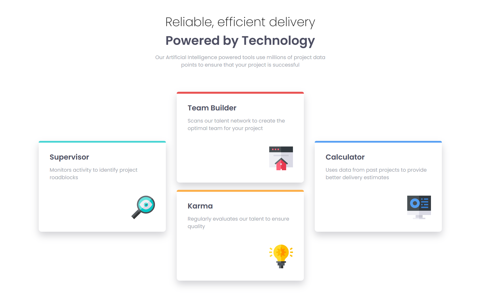
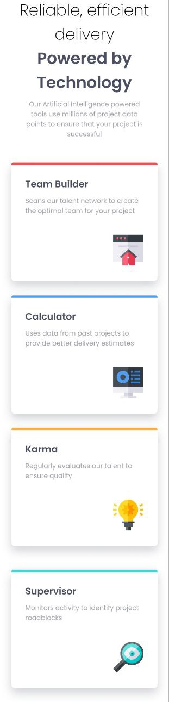

# 😶‍🌫️ Four Card Feature Section - Page Solution

This is my first solution to the [Four card feature section challenge on Frontend Mentor](https://www.frontendmentor.io/challenges/four-card-feature-section-weK1eFYK) and took me 8 hours to complete. Frontend Mentor challenges help you improve your coding skills by building realistic projects. If you are a beginner you really need to try this!

## 🪞 Screenshots

## 🎥 Live WebSite

- [Live site URL](https://alexandru-ghergu.github.io/four-card-feature-section/)

## 🪄 Technologies

- `HTML5`
- `CSS`
- `Flexbox`
- `Grid`

## 🎢 What I learned

- How Grid works.
